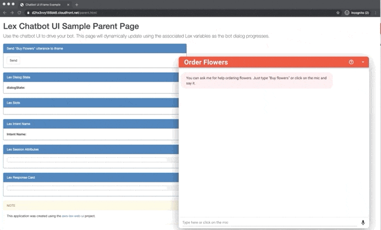

# Sample Amazon Lex Web Interface with API connection via AWS Lambda Function

# Overview
This is a sample [Amazon Lex](https://aws.amazon.com/lex/)
web interface. It provides a chatbot UI component that can be integrated
in your website. The interface allows a user to interact with a Lex bot directly
from a browser using text or voice.

It can be used as a full page chatbot UI:

Or embedded into an existing site as a chatbot widget:

### Features
- Mobile ready responsive UI with full page or embeddable widget modes
- Support for voice and text with the ability to seamless switch from
one mode to the other
- Voice support provides automatic silence detection, transcriptions
and ability to interrupt responses and replay recordings
- Display of Lex response cards
- Ability to programmatically configure and interact with the chatbot
UI using JavaScript
- API Connectivity

# Getting Started
The easiest way to test drive the chatbot UI is to deploy it using the
[AWS CloudFormation](https://aws.amazon.com/cloudformation/) templates
provided by this project. Once you have launched the CloudFormation stack,
you will get a fully working demo site hosted in your account.

For more Details of configuration and activation of AWS Lex Bot in your AWS Account. You can go through [https://github.com/vivifyhealthcare/aws-lex-web-ui]

----------
# API Integration in AWS LEX Bot by Using Lambda Function
### AWS Lambda Function
- AWS Lambda is a serverless computing service provided by Amazon Web Services (AWS). It allows you to run your code (such as     microservices, background jobs, or event-driven functions) without having to provision or manage servers.

- With Lambda, you simply upload your code and set up triggers, such as API Gateway, S3, SNS, or CloudWatch events. The service automatically scales and runs your code in response to incoming requests or events, and you only pay for the compute time you consume.

- This makes it easy to build and run applications and services without having to worry about infrastructure management, and enables you to focus on writing code and adding business value.

### Integrate API's in AWS Lambda Function
- To integrate APIs in an AWS Lambda function, you can follow these steps:

  * Create a Lambda function in the AWS Management Console.
  * Select the appropriate runtime (e.g. Node.js, Python, etc.) for your function.
  * Write the code for your function, including the API integration logic.
  * Create a REST API using API Gateway, and configure it to trigger your Lambda function.
  * Deploy the API to a stage and test it by making API requests.
  * Optionally, you can add authentication and authorization to your API using AWS Cognito or IAM.

- You can also integrate API in AWS Lambda by using the Serverless Framework or AWS CloudFormation. These tools allow you to automate the deployment and management of your API and Lambda function.

### Connect AWS Lambda Function in AWS Lex Bot
- To connect an AWS Lambda function to an AWS Lex bot, follow these steps:

  * Create a Lambda function in the AWS Management Console or using the AWS CLI.
  * Write the code for your function, which should contain the logic for handling the intent requests from the Lex bot.
  * In the AWS Management Console, navigate to the Lex bot and select the appropriate intent.
  * In the Intent Editor, go to the "Fulfillment" section.
  * Choose "AWS Lambda Function" as the fulfillment method and select the Lambda function you created.
  * Save and build the bot.
  * Test the integration by using the "Test Bot" feature in the Lex Console.

- Once the integration is set up, the Lex bot will send intent requests to the Lambda function, which will then process the requests and return a response to the bot. The bot will use the response to generate a response to the user.

 

